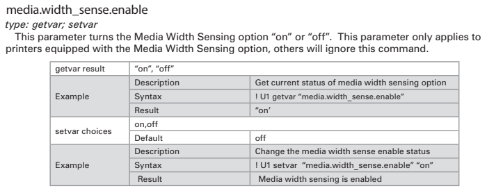

# ラベル幅検知センサを有効化/無効化する方法 (ZQ6/ZQ5/Qln)

モバイルプリンタはメディア幅センサー（media.width_sense.enable）を有効化することで、ご利用のラベル幅を検知することができます。このセンサーを利用することによって、不特定多数のラベルを単一プリンタで利用する運用環境などで柔軟な印刷処理が可能です。

  

## 活用例、
- 挿入されているラベルと印刷プログラムが一致しない場合は印刷しない
- 自動でラベルサイズに合わせて、拡大・縮小印刷をする

 
逆にセンサーを利用しない場合は無効化（off）することを推奨いたします。

  
## 取得可能情報

ラベル幅は単位 mm/cm/dots/inchで取得可能です。 

    media.width_sense.in_mm : 63.3 
    media.width_sense.in_cm : 6.33 
    media.width_sense.in_dots : 506 
    media.width_sense.in_inches : 2.493 

例、

    ! U1 getvar "media.width_sense.in_mm" 
    63.3

  
## 有効化、無効化コマンド

有効化  

    ! U1 setvar "media.width_sense.enable" "on"

無効化  

    ! U1 setvar "media.width_sense.enable" "on"

  

# 参考；Syntax

